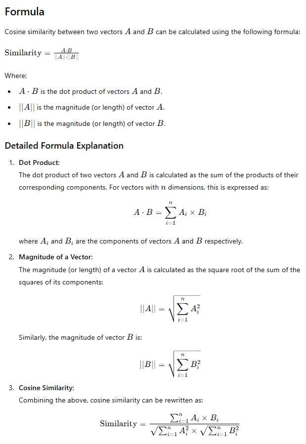

# Cosine-Similarity

This program measures the similarity between two sentences using cosine similarity. Cosine similarity is a measure of similarity between two non-zero vectors of an inner product space that measures the cosine of the angle between them.

> Cosine similarity is a measure of similarity that focuses on the angle between vectors. It produces a value ranging from -1 to 1.

A cosine similarity of 1 indicates that the vectors are perfectly aligned, signifying identical directions.
A cosine similarity of 0 suggests that the vectors are orthogonal (perpendicular) to each other, implying no similarity.
A cosine similarity of -1 means that the vectors are exactly opposite in direction

## Requirements

Cosine similarity and the NLTK (Natural Language Toolkit) module are used in this program. To execute this program, the NLTK module must be installed on your system. Follow the steps below to install the NLTK module:

1. Open terminal 
2. Run the command: `pip install nltk`
3. Open Python3 interpreter: `python`
4. Import NLTK: `import nltk`
5. Download all NLTK data: `nltk.download('punkt')` and `nltk.download('stopwords')`

## Functions Used

### `nltk.tokenize`
Tokenization is the process of dividing a large quantity of text into smaller parts called tokens. The function `word_tokenize(X)` splits the given sentence `X` into words and returns a list.

### `nltk.corpus`
In this program, it is used to get a list of stopwords. A stopword is a commonly used word (such as "the", "a", "an", "in") that is filtered out before processing the text.

